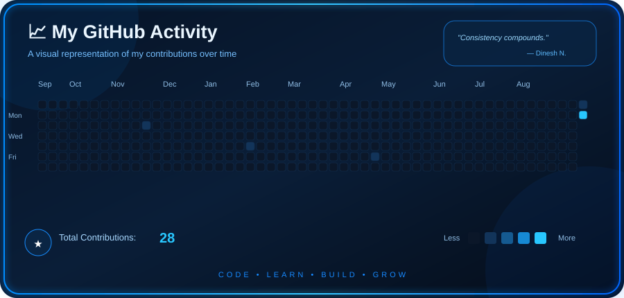

<div align="center">

# 👋 Hey, I'm Dinesh N

### 💻 Computer Science Engineering Student • Developer • AI Enthusiast


<br>

<a href="https://portfolio-five-ivory-cooylnepo0.vercel.app/">

</a>
<a href="https://www.linkedin.com/in/dinesh-n-53036a306/">

</a>
<a href="https://github.com/dxnesh-22">

</a>

</div>

---

## 🚀 About Me

```python
class Dinesh:

    role = "Computer Science Engineering Student"

    interests = [
        "Software Development",
        "Artificial Intelligence",
        "Machine Learning",
        "Data Analysis",
        "Data Structures & Algorithms"
    ]

    currently_learning = [
        "Advanced DSA",
        "Java",
        "AI / ML",
        "Data Engineering"
    ]

    goal = "Build useful software and keep getting better every day 🚀"
```

---

## 🛠️ Tech Stack

### 💻 Languages

<p>

</p>

### 🌐 Web Development

<p>

</p>

### 🗄️ Data & Databases

<p>

</p>

### ⚙️ Tools & Platforms

<p>

</p>

---

## 🧠 What I'm Working On

* 🔥 Strengthening **Data Structures & Algorithms**
* ☕ Improving my **Python** skills
* 🤖 Exploring **AI & Machine Learning**
* 📊 Working with **Data Analysis**
* 🌐 Building and improving **web applications**
* 🚀 Creating projects that solve real-world problems

---

## 🚀 Featured Projects

<table>
<tr>

<td width="50%">

### 🤖 Readme Agent

An AI-powered project designed to assist developers with generating and improving README documentation.

**Tech:** Python • AI • Automation

</td>

<td width="50%">

### 🧩 ClueBox

A web-based project focused on creating an interactive application experience.

**Tech:** Python • Flask • HTML • CSS

</td>

</tr>

<tr>

<td width="50%">

### 🍽️ HungerSync

A web application built around food-related coordination and management.

**Tech:** Python • Flask • HTML • CSS

</td>

<td width="50%">

### 🧠 More Coming Soon...

Always experimenting, learning, and building something new.

**Stay tuned 🚀**

</td>

</tr>
</table>

---

## 📊 GitHub Stats

<div align="center">


</div>

---

## 🐍 Watch My Contributions Get Eaten!

<div align="center">


</div>

---

## 📈 My GitHub Activity

<div align="center">



</div>
---

## 💡 Developer Philosophy

<div align="center">

> **"Learn → Build → Break → Fix → Repeat."**

<br>

Every bug is a lesson.
Every project is an opportunity to improve.
Every problem is another chance to learn.

</div>

---

## 📫 Let's Connect

<div align="center">

<a href="https://portfolio-five-ivory-cooylnepo0.vercel.app/">

</a>

<a href="https://www.linkedin.com/in/dinesh-n-53036a306/">

</a>

<br><br>

### ⭐ If you find something interesting here, consider giving it a star!

</div>

---

<div align="center">


</div>
